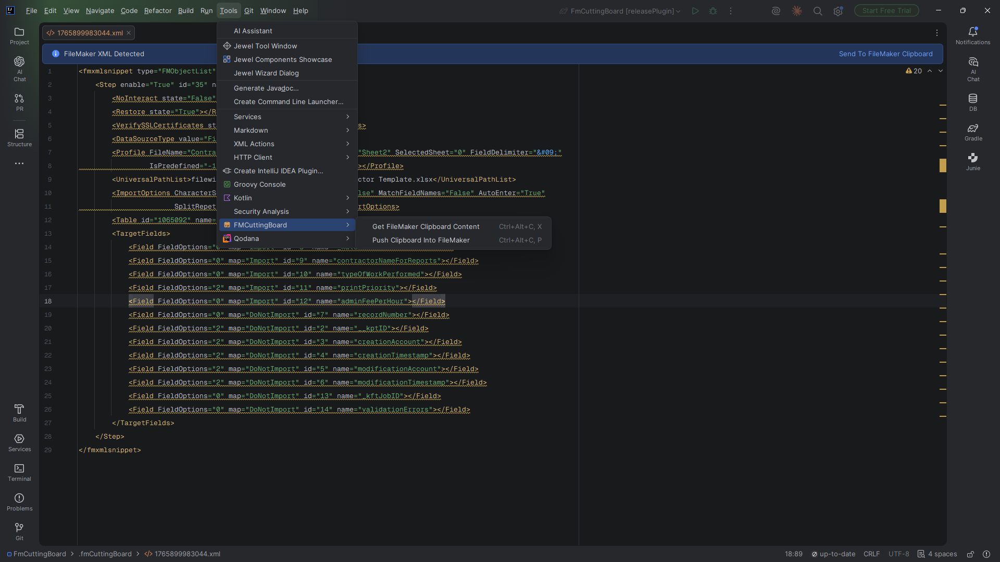
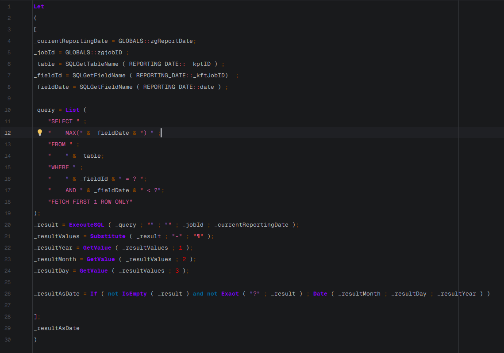

# FMCuttingBoard

<!-- CI Status Badges -->

- A plugin for JetBrains IDEs
- When installed, the user will have a new menu item in their IDE's `Tools` menu
- The new menu item will be named the same as this plugin
- The new menu item will itself be a submenu:
  - Convert FM Clipboard To XML Clipboard 
  - New XML File From FM Clipboard
  - Push Clipboard Into FileMaker (only enabled when XML file is currently active)

## Quick Start
- Install the plugin (build locally with Gradle or install the ZIP from Releases/Marketplace).
- Open any project in your JetBrains IDE.
- Find Tools > FMCuttingBoard in the main menu.
- Copy content from FileMaker (e.g., script steps, fields, etc.).
- Use one of the FMCuttingBoard actions described below.

## Convert FM Clipboard To XML Clipboard
When this option is selected, we will attempt to read FileMaker content from the clipboard.
If we are successful in finding FileMaker content, then the clipboard will be replaced with it

## New XML File From FM Clipboard
When this option is selected, we will attempt to read FileMaker content from the clipboard.  
If we are successful in finding FileMaker content, it will be written to file.
The file it's written to should be a file whose name is timestamped (perhaps using unix/epoch).
The file will be XML format.
That file will be stored within the project's `.fmCuttingBoard` directory (off of root).
In the event the directory doesn't exist at the time we need to create a file in it, then we will create the folder.
When creating the folder, we will always add a `.gitignore` to it as well.
The .gitigore will contain only a `*` character.

## Push Clipboard Into FileMaker
When this option is selected, we will attempt to populate the clipboard with content FileMaker will properly recognize.
In essence, this option is doing the opposite of what we're doing in `New XML File From FM Clipboard`.
We're taking plain XML, and repackaging it into a new clipboard that we'll later be able to paste into FileMaker.
The trick will be in getting the format right.  
If the fmxmlsnippet represents database fields, then after running this command the user would be able to paste fields into FileMaker's Manage Database dialog.
If it contains an fmxmlsnippet of script steps, then we'd be able to paste Script Steps into FileMaker Script Workspace window, etc...

## Usage Examples

1) Convert FileMaker clipboard to XML on the clipboard
- Copy a set of Script Steps inside FileMaker Script Workspace.
- In the IDE: Tools > FMCuttingBoard > Convert FM Clipboard To XML Clipboard.
- Paste into the IDE to view raw fmxmlsnippet, or save to a file.

2) Save XML to a timestamped file
- Copy any supported content in FileMaker (Fields, Tables, Scripts, etc.).
- In the IDE: Tools > FMCuttingBoard > New XML File From FM Clipboard.
- The plugin creates .fmCuttingBoard/fmclip-{timestamp}.xml in your project.

3) Push XML back into FileMaker
- Open one of the sample XML files under docs/reference/resources/test-snippets (e.g., ScriptSteps.xml).
- In the IDE: Tools > FMCuttingBoard > Push Clipboard Into FileMaker.
- Switch to FileMaker and Paste in the appropriate context.

Notes
- You can customize the base directory and filename pattern via Settings/Preferences > Tools > FMCuttingBoard.
- Optionally enable a preview before writing to the clipboard, and diagnostics logging for troubleshooting.

## Screenshots

The plugin's icon (small, visible next to "FMCuttingBoard" in the menu above) is used as the icon for the `Tools > FMCuttingBoard` menu item.

## Known Limitations
- Clipboard interoperability depends on OS behavior (Windows and macOS supported; Linux is not).
- FileMaker’s accepted clipboard formats can vary slightly by version; not all fmxmlsnippet variants may import identically across versions.
- Very large fmxmlsnippet payloads may be truncated by the OS clipboard. The plugin guards where practical but cannot fully control OS limits.
- On macOS, some pasteboard flavors are undocumented; behavior is best-effort based on observed formats.
 - See also: docs/Windows-EndToEnd-Test-Report.md for version-specific observations and paste outcomes.

## Privacy
- FMCuttingBoard makes no network calls and collects no telemetry or analytics.
- It only reads/writes the system clipboard and files within your project's `.fmCuttingBoard` directory. Nothing leaves your machine.

## Future Ideas
- Richer transformations and refactorings of fmxmlsnippet content directly in the IDE.
- Additional validations and quick‑fixes tailored to FileMaker-specific constructs.
- Deeper integration with FileMaker (e.g., launching scripts, schema diffs, etc.) where feasible.
- More actions surfaced in context menus and editor toolbars for quicker workflows.
 - Track and prioritize enhancements in docs/reference/FMCuttingBoardPluginRoadmap.md and docs/reference/ROADMAP.md.

## Development

- The JetBrains plugin lives in the `jetbrains/` folder; run the Gradle commands below from there (open `jetbrains/` as the project in IntelliJ IDEA).
- Run the plugin in a sandbox IDE: `./gradlew runIde` (or `gradlew.bat runIde` on Windows)
- Run tests: `./gradlew test`
- The project uses JUnit 5 for unit tests and a GitHub Actions workflow to build and run tests on pushes/PRs.

### Releasing (tag prefixes)

> [!IMPORTANT]
> **Plain `v*` tags (e.g. `v1.0.7`) no longer publish anything.** Releases are triggered by a per-plugin tag prefix:
>
> | Plugin | Tag format | Must match | Workflow |
> |---|---|---|---|
> | JetBrains | `jetbrains-v<version>` (e.g. `jetbrains-v1.0.7`) | `pluginVersion` in `jetbrains/gradle.properties` | `.github/workflows/release-jetbrains.yml` |
> | VS Code | `vscode-v<version>` (e.g. `vscode-v0.1.0`) | `version` in `vscode/package.json` | `.github/workflows/release-vscode.yml` (steps and one-time setup: `vscode/CONTRIBUTING.md`) |
>
> If you push an old-style `v1.2.3` tag by mistake, the **Release tag guard** workflow fails with a message telling you which tag to push instead. Delete the wrong tag and push the right one.
>
> The existing `v1.0.0`–`v1.0.6` tags are historical JetBrains releases from before this repo held more than one plugin.

### In‑IDE Help
- Open Settings/Preferences and search for "FMCuttingBoard". A Documentation button links to the online README for quick reference.

### Build & Install from Disk
- Build a distributable plugin ZIP: `./gradlew buildPlugin` (or `gradlew.bat buildPlugin` on Windows)
- Or use the convenience alias: `./gradlew releasePlugin`
- The artifact will be created under: `jetbrains/build/distributions/FMCuttingBoard-<version>.zip`
- Install it in your IDE via: Settings/Preferences > Plugins > Gear icon > Install Plugin from Disk… and select the generated ZIP.

### Branding
- The plugin uses a single SVG icon provided by the project owner; no dark variant is used.
- Icon asset location used by the IDE:
  - jetbrains/src/main/resources/META-INF/pluginIcon.svg
- Source artwork kept in repo (for editing/exporting):
  - docs/reference/resources/fmCuttingBoardIcon.svg

### Logging and Diagnostics
- The plugin uses the IDE's built-in logging (idea.log). To view logs:
  - Help -> Show Log in Explorer/Finder, then open idea.log
- Verbose diagnostics can be enabled for troubleshooting by starting the IDE with:
  - JVM option: `-Dfmcuttingboard.verbose=true`
  - Or environment variable: `FMCUTTINGBOARD_VERBOSE=true`
- When errors occur, notifications may include a "Show Details" action with a stack trace to assist debugging.

## License
This project is licensed under the MIT License — see [LICENSE](LICENSE) for details.